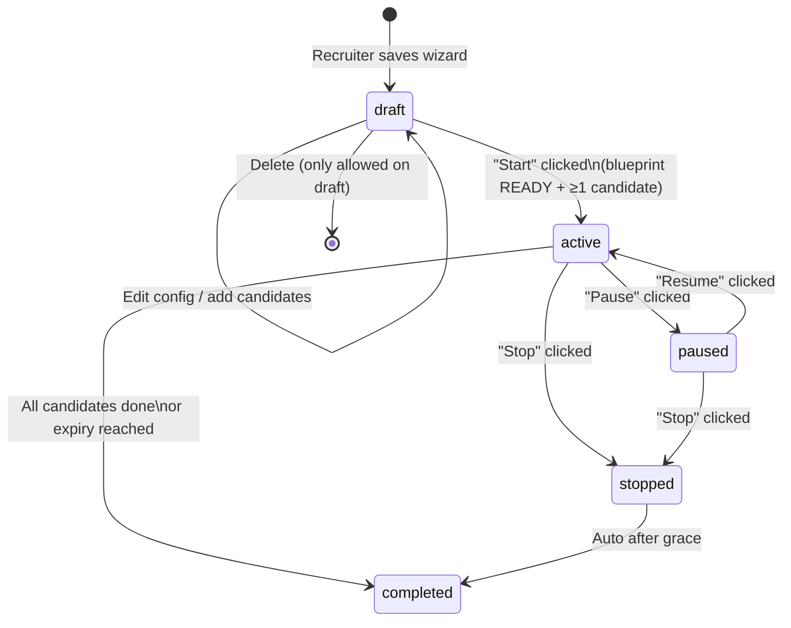
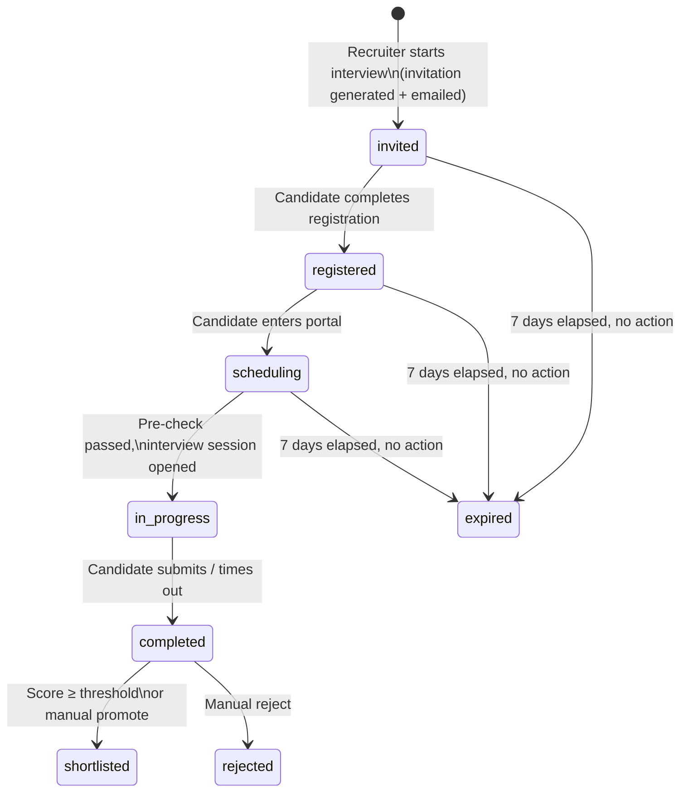

# FunnelHQ — Recruiter Portal Flow & Status Reference

**Audience:** Product · Design · Engineering — single source of truth for what happens, when, and to whom.
**Last updated:** 2026-05-11 (post pipe-reconnect: blueprint auto-fires, invitations at-create, evaluation results sync to candidate doc)

---

## TL;DR

```
RECRUITER                                           CANDIDATE
─────────                                           ──────────
1. Sign in (Google OAuth)
2. Create interview (2-step wizard)
3. AI generates blueprint  ────────────────►        (no candidate touch yet)
4. Click "Start" + invite candidates
5.                          ────invite email────►   6. Click invite link
                                                    7. Accept invitation
                                                    8. Register / log in
                                                    9. Open candidate portal
                                                    10. Pre-check (mic/camera)
                                                    11. Take AI interview
12. Watch live updates  ◄─────────────────────       12. Submit interview
    (NBA refreshes via SSE)
13. Review transcript + score
14. Shortlist / reject (manual or auto)             15. See results page
                                                        (limited view)
```

The product collapses into **3 mental models**:
- **Interview status** — what state the recruiter's interview record is in
- **Candidate status per interview** — where each candidate is in the funnel for that interview
- **Recruiter NBA (Next Best Action)** — what the system thinks the recruiter should do next, computed from the above

---

## 1) Recruiter journey (10 steps)

| # | Action | UI | Backend route | What changes |
|---|---|---|---|---|
| 1 | Sign in | `MarketingLanding` → "Sign in" → Google OAuth | `GET /api/auth/google/callback` | Session cookie + JWT, redirect to `/dashboard` |
| 2 | Land on dashboard | `Dashboard.tsx` | `GET /api/auth/me`, `GET /api/workspaces`, `GET /api/workspaces/{wid}/projects/{pid}/interviews` | Stats row + recent interviews + NBA card |
| 3 | Click "Create New Interview" | `Dashboard.tsx:112` | none yet | Navigate `/interviews/create` |
| 4 | Pick interview type (Screening or Fitment) | `CreateInterview.tsx` Step 0 | `GET /api/projects/{pid}/available-templates?template_type={t}` | Loads template chooser |
| 5 | Configure title + duration + voice; AI auto-fills description | `CreateInterview.tsx` Steps 1-2 | `POST /api/suggestions` (live preview), `POST /api/blueprint-preview` | Right-rail preview updates as user types |
| 6 | Save & generate blueprint | `CreateInterview.tsx` Step 3 | `POST /api/workspaces/{wid}/projects/{pid}/interviews` | Interview row created, status `draft`. For non-template: `blueprintStatus='generating'` immediately + LangGraph agent fires as a FastAPI BackgroundTask → resolves to `'completed'` (or `'failed'`) in ~10-20s. For template: `blueprintStatus='ready'` synchronously copied from template. (F1) |
| 7 | (Bundled into step 6) Candidates fanned out | — | (same POST) | Every candidate from `selectedListIds` gets a row in `candidate_invitations` with `status='pending'` and `invitation_sent=false`. Idempotent — re-running create skips already-invited candidates. `interview.candidateCount` set. Stats endpoint reads from here, so TOTAL CANDIDATES is correct from page-load #1. (F2) |
| 8 | Click "Start" on draft interview | `ManageInterviewsEnhanced.tsx:251-334` | `POST /api/workspaces/{wid}/projects/{pid}/interviews/{id}/start` | Status `draft` → `active`, **existing** invitation rows flipped to `invitation_sent=true`, SES emails go out. No new rows created (already done at create). |
| 9 | Monitor: pause / resume / stop | `ManageInterviewsEnhanced.tsx:348-391` | `POST .../interviews/{id}/{pause,resume,stop}` | Status transitions, candidate portal access changes |
| 10 | Review results | `InterviewDetails.tsx` (screening) or `FitmentInterviewDetails.tsx` (fitment) | `GET /api/interviews/{id}/candidates`, `GET /api/sessions/{id}/results` | Transcripts, scores, recordings; export to qualified-list |

**Routing dispatch (post-fix):** `ManageInterviewsEnhanced.handleViewDetails` now reads `interview.type` and routes screening → `/interviews/{id}`, fitment → `/fitment-interviews/{id}`.

---

## 2) Candidate journey (8 steps)

| # | Action | UI | Backend route | What changes |
|---|---|---|---|---|
| 1 | Receive invitation email | (email client) | — | Link contains unique `invitation_token` |
| 2 | Click "Accept invitation" link | `AcceptInvitation.tsx` | `GET /api/accept-invitation/{token}` | Token validated; checks if invited email matches logged-in user |
| 3 | Register or log in (if new) | `CandidateRegistration.tsx` | `POST /api/register/{token}`, AI extracts resume | Candidate row created/linked; profile pre-filled from resume |
| 4 | Open candidate portal | `CandidatePortal.tsx` | `GET /api/candidate-portal/{token}` | Portal data: candidate profile + list of assigned interviews + interview details |
| 5 | Click "Start interview" on assigned card | `CandidatePortal.tsx` | navigate `/interview/{id}/pre-check` | — |
| 6 | Pre-check: mic + speaker + camera | `interview/InterviewPreCheckPage.tsx` | `POST /api/agent-sessions/prepare` | sessionId minted; resume preprocessed for AI context |
| 7 | Take live AI interview (~10-25 min) | `interview/InterviewSessionPage.tsx` + `components/interview/InterviewSession.tsx` | WebSocket: `wss://.../ws` (STT) + `POST /api/interview-prelims-agent` (LLM turns) + Cartesia TTS | Conversation history streamed; recording uploaded chunked |
| 8 | Submit / time-out → Thank you | `interview/InterviewThankYouPage.tsx` | `POST /api/sessions/{id}/complete` | LangGraph reviewer agent triggered async; recruiter NBA updates via SSE |

---

## 3) Status state machine (Mermaid)

### Interview status (recruiter-owned)



**blueprintStatus** is a sub-state of `draft`/`active`: `pending → generating → ready` (or `error`). Only `ready` interviews are startable.

### Candidate status (per interview, candidate-owned)



**Sources of these strings (from grep):**
- `invited`, `registered`, `scheduling`, `in_progress`, `completed` — `services/candidate_invitation_service.py`, `pages/CandidatePortal.tsx`, `pages/InterviewDetails.tsx`
- `shortlisted`, `rejected` — set by recruiter actions in `services/qualified_lists_service.py`
- `expired` — set by `funnelhq_api/scheduler.py` cron (every 5 min)

---

## 4) Recruiter ↔ candidate handoff points

| Trigger | Direction | Backend | Real-time? | Where it surfaces |
|---|---|---|---|---|
| Recruiter clicks "Start" | R → C | `POST /interviews/{id}/start` → SES email | Email (async) | Candidate inbox |
| Candidate accepts invitation | C → R | `POST /workspaces/{wid}/invitations/{id}/accept` | **Polling** (recruiter must refresh ManageInterviews) | Manage table candidate count |
| Candidate completes registration | C → R | `POST /register/{token}` | **Polling** | InterviewDetails participants list |
| Candidate enters interview session | C → R | session created in Firestore | **Polling** | InterviewDetails activity timeline |
| Candidate submits interview | C → R | `POST /sessions/{id}/complete` → LangGraph reviewer (async) | ✅ **SSE** (Dashboard + Manage + InterviewDetails) | NBA, stats, table, and per-candidate row all refresh live within 5s |
| Recruiter shortlists / rejects | R → C | `POST /lists/{id}/candidates`, `PATCH /candidates/{id}/status` | none → email if configured | Candidate portal status badge changes on next open |

**Real-time coverage (current):**
- Per-interview detail: `GET /api/interviews/{id}/events` — InterviewDetails subscribes via inline `EventSource`, bumps `liveRevision`, refetch effects re-run.
- Workspace-level list: `GET /api/workspaces/{wid}/projects/{pid}/interviews/events` — Dashboard + ManageInterviews subscribe via `useInterviewListLiveUpdates` hook (`src/hooks/useInterviewListLiveUpdates.ts`).
- Both streams: 5s poll, diff-only emit, 25s heartbeat to defeat proxy idle timeouts. Auth via JWT query param (EventSource limitation).

**Evaluation result fan-out (F3):**
- Reviewer agent writes canonical results to `interview_results/{session_id}` (full skill breakdown, graph, transferables).
- Same agent step then patches `candidates/{candidate_id}` with summary fields the curated-list card already reads: `overallScore`, `scores.{screening|fitment|prelims}`, `keyStrengths`, `matchedRoles` (skills ≥ 75), `recommendation`, `evaluationStatus='evaluated'`, `lastEvaluatedAt`. Zero frontend change required — the existing `CandidateCard.tsx:231-239` reads these paths.
- Non-fatal: patch failure logs but the canonical results write is the source of truth.

**No real-time gaps remain in the recruiter portal.** Candidate-side surfaces still poll/refresh on action — fine because candidates trigger their own state changes.

---

## 5) NBA (Next Best Action) state machine

The NBA card on the Dashboard tells the recruiter exactly what to do next. Logic in `src/lib/nextBestAction.ts`. Inputs: interview status, blueprint status, candidate counts, completion counts.

| Recruiter state | NBA card | CTA |
|---|---|---|
| 0 interviews | "Create your first interview" | → `/interviews/create` |
| Has draft, blueprint generating | "Blueprint cooking…" | (waiting) |
| Has draft, blueprint ready, 0 candidates | "Add candidates" | → resume wizard at step 1 |
| Has draft, blueprint ready, ≥1 candidate | "Start interview" | → POST start |
| Active, 0 invited candidates accepted | "Share invite link" | copy link to clipboard |
| Active, ≥1 in-progress candidates | "Watch live" | → InterviewDetails |
| Active, ≥1 completed candidates | "Review responses" | → InterviewDetails |
| Active, ≥3 completed with high scores | "Shortlist top candidates" | → bulk shortlist |
| All candidates done | "Wrap up — export shortlist" | → qualified list export |

The NBA card is the single most important UI element on the dashboard — it abstracts the entire state machine into one decision per visit.

---

## 6) Status reference (every string, what it means, who sets it)

| Status | Owner | Set by | UI affordances |
|---|---|---|---|
| `draft` | interview | wizard save | Edit, Add candidates, Start (if blueprint ready), Delete |
| `active` | interview | `/start` route | Pause, Stop, View details, Share invite link |
| `paused` | interview | `/pause` route | Resume, Stop |
| `stopped` | interview | `/stop` route | View details, Restart |
| `completed` | interview | auto when all candidates done | View details, Export |
| `pending` (blueprint) | interview.blueprintStatus | initial state | (locked, can't start) |
| `generating` (blueprint) | interview.blueprintStatus | LangGraph blueprint agent in flight | Show "cooking" state |
| `ready` (blueprint) | interview.blueprintStatus | blueprint agent saves | Unlocks Start |
| `error` (blueprint) | interview.blueprintStatus | blueprint agent failure | "Retry generation" CTA |
| `invited` | candidate | `/start` route generates invitations | Email sent; awaiting click |
| `registered` | candidate | `/register/{token}` | Candidate has account, hasn't entered interview |
| `scheduling` | candidate | candidate opens portal | In portal, hasn't started session |
| `in_progress` | candidate | session prepared via `/agent-sessions/prepare` | Live interview |
| `completed` | candidate | `/sessions/{id}/complete` | Reviewer agent triggered |
| `shortlisted` | candidate | recruiter promotes to qualified list | Visible in qualified-list dashboard |
| `rejected` | candidate | recruiter rejects | Hidden from default views |
| `expired` | candidate | scheduler cron after 7 days no action | Greyed out, "Re-invite" CTA |

---

## 7) Where each status surfaces in the UI

```
┌─ Recruiter views ──────────────────────────────────────────────────┐
│                                                                     │
│  Dashboard                                                          │
│   ├─ Active stat               ← interviews where status == active  │
│   ├─ Total candidates          ← sum of candidates across all       │
│   ├─ Completion rate           ← completed / invited                │
│   └─ NBA card                  ← computed from all of the above     │
│                                                                     │
│  Manage Interviews (Screening)                                      │
│   └─ Status badge              ← interview.status                   │
│     + Type badge               ← interview.type                     │
│     + Participation column     ← (registered + completed) / invited │
│     + Action menu              ← gated by status (Pause if active…) │
│                                                                     │
│  Interview Details                                                  │
│   └─ Per-candidate row status  ← candidate.status                   │
│     + Action buttons           ← gated by candidate.status          │
│                                                                     │
└─────────────────────────────────────────────────────────────────────┘

┌─ Candidate views ──────────────────────────────────────────────────┐
│                                                                     │
│  Candidate Portal                                                   │
│   ├─ Interview card status     ← interview.status (active = open)  │
│   └─ "Start" button            ← gated by candidate.status          │
│     (only if scheduling)                                             │
│                                                                     │
│  Interview Results (read-only)                                      │
│   └─ Status banner             ← "Completed" / "Under review"       │
│                                                                     │
└─────────────────────────────────────────────────────────────────────┘
```

---

## 8) Known UX gaps (input to next planning round)

1. ~~**Stale participation counts**~~ — ✅ **FIXED** via workspace-level SSE in Dashboard + Manage.
2. ~~**Slow blueprint document fetches**~~ — ✅ **FIXED** via `collection_group('interviews')` query + backfill in `get_invitation_by_token`.
3. ~~**No bulk shortlist**~~ — ✅ **FIXED** with one-click "Shortlist N" green banner on InterviewDetails when ≥1 candidate scored ≥75%. Reuses existing AddToQualifiedListModal.
4. ~~**Candidate "expired" status has no recovery path"**~~ — ✅ **FIXED** via `POST /api/interviews/{id}/resend-invitations` endpoint + amber "Re-invite" banner on InterviewDetails for scheduling/expired/invited candidates.
5. **`fitment` interviews historically routed to wrong details page** — ✅ fixed; but the duplication of InterviewDetails / FitmentInterviewDetails (~2000 + ~1275 LOC, ~30% overlap) is technical debt. Consider unifying with a common base + type-specific extensions.
6. ~~**Blueprint stuck at "Not Found" after create**~~ — ✅ **FIXED** (F1): `create_interview` sets `blueprintStatus='generating'` for non-template path and schedules the LangGraph blueprint agent as a FastAPI BackgroundTask. Existing polling loop in InterviewDetails:698 converges automatically.
7. ~~**TOTAL CANDIDATES = 0 after create**~~ — ✅ **FIXED** (F2): `prepare_invitations_for_lists` runs during `create_interview` and writes invitation rows for every list member (without emailing). Stats endpoint reads from there so the page reflects the correct count from page-load #1.
8. ~~**Evaluation results never surface on curated list**~~ — ✅ **FIXED** (F3): reviewer agent additionally patches `candidates/{candidate_id}` with score + tags right after the canonical write to `interview_results`. CandidateCard reads from there; no frontend change.
9. ~~**"Add to List" success without UI update**~~ — ✅ **FIXED** (F4): ListDetail's onSuccess hook now calls `loadListData()` so the post-add view reflects the new state.
10. ~~**Candidate count mismatch (Screening list shows 2, InterviewDetails shows 0)**~~ — ✅ **FIXED** (F7): canonicalized on `candidate_invitations` row count. See §10 below.

---

## 10) Candidate-count canonical source (F7)

Every "how many candidates does this interview have" question reads from **one place**: the count of rows in `candidate_invitations` where `interview_id == this`. Previously different surfaces drifted between three sources (`interview.candidateCount` stored field, walking `interview.lists → list candidates subcollection`, summing across rows). F7 ended the drift.

| Surface | Backend path | Source |
|---|---|---|
| InterviewDetails "TOTAL CANDIDATES" card | `GET /interviews/{id}/stats` | `_count_invitations_for_interview(id)` |
| Screening list "Candidates" column | `GET /workspaces/.../interviews` | `_count_invitations_for_interviews_batch([ids])` — chunked `in` query, 30 IDs/round-trip |
| Dashboard NBA + hero stats | same list endpoint | inherits the batched count |
| Stored `interview.candidateCount` | every `prepare_invitations_for_lists` call | re-synced via `_sync_interview_candidate_count` after fan-out |

Single source of truth. No more 0-vs-2 surprises.

---

## 9) Reference implementation pointers

- NBA state machine: `src/lib/nextBestAction.ts`
- Status badge component: `src/components/dashboard/StatusBadge.tsx`
- Routing dispatch: `src/pages/ManageInterviewsEnhanced.tsx::handleViewDetails`
- SSE subscription: `src/pages/Dashboard.tsx` (look for `EventSource`)
- LangGraph reviewer trigger: `services/interview_session_service/interview_session_service.py::trigger_n8n_review` (despite the legacy name, this calls LangGraph now)
- Blueprint generation: `services/blueprint_service/blueprint_agent_service.py`
